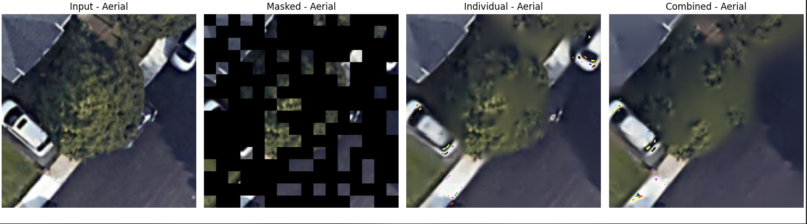

# ViT Foundry

This package contains tools for rapid prototyping of vision transformer (ViT) models. It was created due to the inherent difficulty of modifying vision transformer libraries such as HuggingFace's or MetaAI's. The idea is to create the building blocks of transformers to favour [composition over inheritance](https://en.wikipedia.org/wiki/Composition_over_inheritance). This modular approach allows you to setup and tear down exotic architectures more easily.

ViT Foundry was primarily used in the early stages of my research when I was experimenting with different models and research hypotheses. It also served as an opportunity to build a few state-of-the-art models from scratch to really understand how everything fits together. **This repository should be strictly considered as research code, not production code.** Below is a list of models implemented:

## Masked Auto-Encoder (MAE)
The base MAE was reimplemented in `vit_mae.py`. Some of the code was recycled and refactored from the HuggingFace implementation. The MAE was made for a project which never fully took off, involving tree classification from aerial and ground-level imagery.

We tested using the standard MAE on [Google's AutoArborist dataset](https://google.github.io/auto-arborist/). By training on over two million images, we were able to get relatively good performance on image reconstruction:

We wanted to use street-level imagery to augment the model's ability to reconstruct the tree, incorporating a spatial bias into the transformer. In the image above, you can see the result of reconstruction using just the aerial, versus using the aerial + street imagery. For the aerial + street imagery model, we concatenated the two images together and fed them in. This may seem naive, but we wanted to build the least amount of inductive bias possible into the model. As you can see, the aerial-only reconstruction was comparable, so this project was abandoned shortly after.

## MaskFormer

the `segmentation` directory contains a set of model components for building the [MaskFormer](https://github.com/facebookresearch/MaskFormer) model with various backbones and pixel decoders. This model runs end-to-end and learns, but the lack of compute resources for adequately training this model led us to change direction.

## Perceiver

Finally, I began reconstructing the [Perceiver](https://arxiv.org/abs/2103.03206) model in the `perceiver` directory. While the code in here technically works, I decided to pursue this as my primary research project and migrated the code over to what is now the [Ecoperceiver](https://github.com/mjfortier/EcoPerceiver) repository. There I iterated upon Perceiver to focus it on carbon flux modelling.
